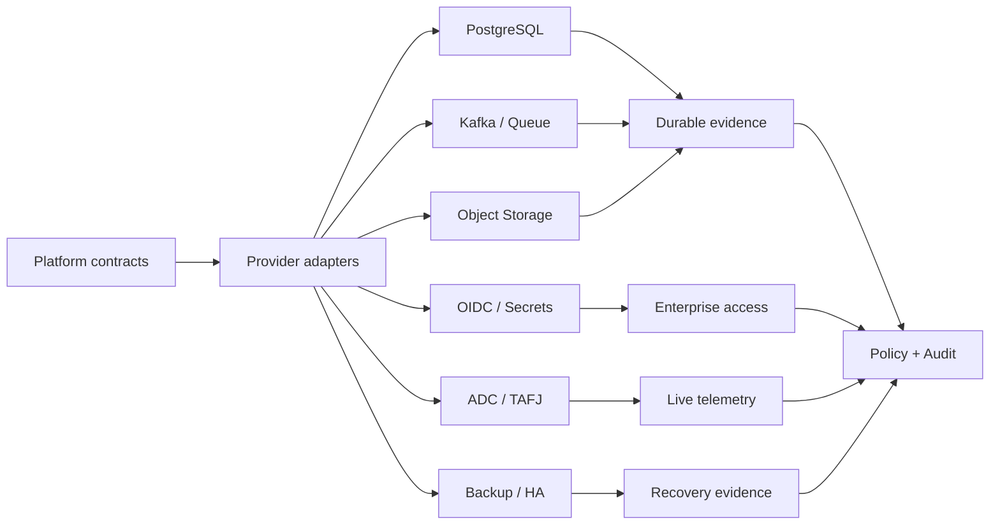
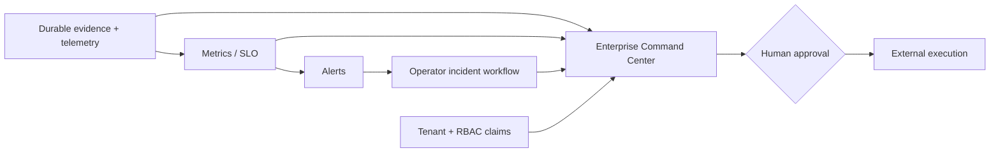
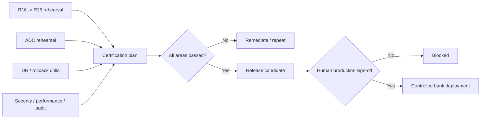

# Temenos Engineering Platform — Phases Flowcharts

Developer reference for the complete platform evolution. Production execution remains external and human-approved.

## Phases 1–17
The completed architecture flows are preserved in git history and prior sections of this document.

## Phase 18 — Production Infrastructure

## Phase 19 — Enterprise Operations

## Phase 20 — Certification & Release

## Final lifecycle

```mermaid
flowchart LR
A[RepoMind] --> B[Temenos-Skills]
B --> C[Upgrade Intelligence]
C --> D[Regression + Migration]
D --> E[ADC Zero-Downtime]
E --> F[Control Tower]
F --> G[Human Approval]
G --> H[External Cutover]
H --> I[Live Evidence]
I --> J[Enterprise Persistence]
J --> K[Observability + Command Center]
K --> L[Certification]
L --> M[Release Sign-off]
M --> N[Controlled Bank Deployment]
```

## Developer Rule
**Intelligence → Contract → Adapter → Infrastructure → Evidence → Policy → Human Approval → External Execution → Audit.**
